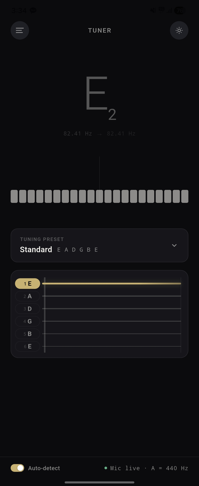
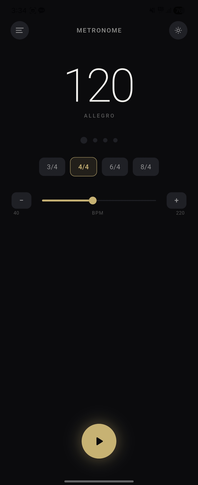

<div align="center">
  
  <h1>FreeTune</h1>
  <p>기타리스트를 위한 정밀 튜너 + 메트로놈 앱</p>

  
  
  
  
</div>

---

## 스크린샷

<div align="center">
  
  &nbsp;&nbsp;&nbsp;
  
</div>

---

## 주요 기능

### 🎸 기타 튜너
- **±50 cents 바 미터** — 21단계 스펙트럼으로 음정 편차를 직관적으로 시각화
- **cents 단위 정밀 표시** — in tune / flat / sharp 상태를 색상으로 구분
- **6현 프렛보드 다이어그램** — 현별 튜닝 완료 여부를 한눈에 확인
- **Auto-detect 모드** — 연주 중 현을 자동으로 감지, 수동 선택도 지원
- **7가지 튜닝 프리셋** — Standard, Drop D, Drop C, Half Step Down, Open G, Open D, DADGAD

### 🥁 메트로놈
- **BPM 조절** — 탭 템포 및 슬라이더로 BPM 설정
- **박자 선택** — 2/4, 3/4, 4/4 등 다양한 박자표 지원
- **비트 인디케이터** — 현재 박자 위치를 시각적으로 표시

### 🎨 공통
- **다크 / 라이트 테마** 전환
- **태블릿 반응형 레이아웃** 지원

---

## 기술 스택

| 항목 | 내용 |
|------|------|
| 프레임워크 | Flutter (Dart) |
| 상태관리 | flutter_riverpod |
| 오디오 캡처 | record, audio_session |
| 피치 감지 | Target-Aware YIN 알고리즘 (자체 구현) |
| 아키텍처 | Clean Architecture (domain / data / presentation) |

**Target-Aware YIN**이란? 기존 YIN 알고리즘에 후보 주파수 윈도우 검색을 추가하여, G3·D3 등 저음 현에서 발생하던 옥타브 에러(−1200 cents 점프)를 구조적으로 차단한 방식입니다.

---

## 빌드 & 실행

### 사전 요구사항

- Flutter 3.x 이상
- Android Studio / Xcode
- AdMob 계정 (프로덕션 빌드 시)

```bash
make dev
```

